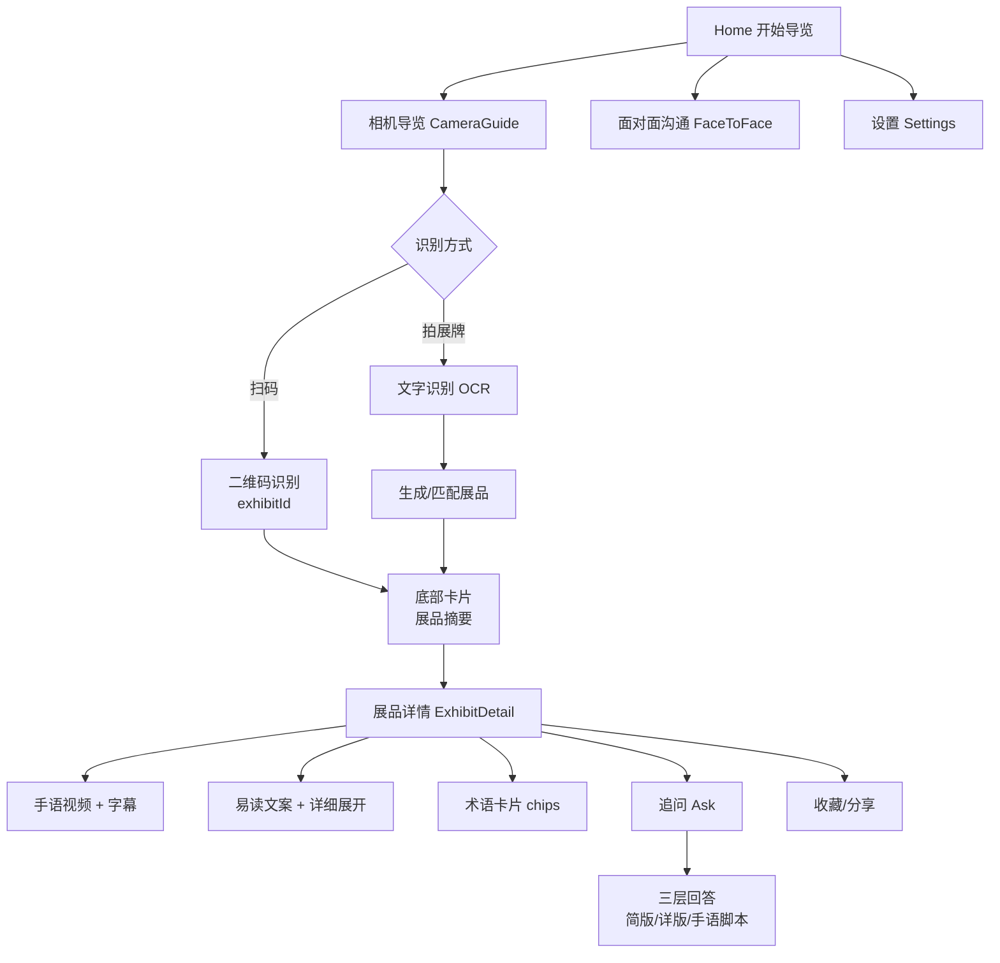

# 博听 Broaden — 用户信息导览图（给 UI/UX 设计对接）

目标用户：听障/聋人参观博物馆

## 1. 用户旅程总览

## 2. 关键流程细化

### 2.1 Home → 相机导览
- 入口：大按钮“开始导览”
- 最近浏览：展示 3–5 个展品
- 无障碍提示卡片：字幕字号可在设置调整

### 2.2 相机导览（两步识别）
1. **拍展牌** → OCR 识别文字 → 生成/匹配展品
2. **拍文物主体** → 保存预览照片，用于详情页展示

状态反馈：
- 识别中
- 识别成功弹底部卡片（Bottom Sheet）
- 失败：提示“未识别到展品，可试试扫码或靠近展牌”

### 2.3 展品详情页
- 手语视频（若无视频显示手语动画占位）
- 字幕展示（支持字号与背景遮罩设置）
- 易读版文本为主、详细信息可展开
- 术语卡片（chips）
- 收藏/分享
- 追问模块（嵌入底部）

### 2.4 追问模块（Ask）
输入框 + 3 个快捷追问按钮：
- 为什么重要
- 制作或修复
- 术语解释

回答输出三层：
- 简版（3–5 句）
- 详版（含引用片段 ID）
- 手语脚本（与简版同义）

### 2.5 面对面沟通
- 左右双栏超大字输入
- 语音转文字按钮占位（后续接 Speech）

### 2.6 设置页
- 字幕字号：小/中/大
- 字幕背景遮罩开关
- 识别触发方式（二维码 / 二维码+文字）
- 隐私说明

## 3. UI/UX 注意事项
- 遵循 iOS 原生组件与材质
- 支持 Dynamic Type 与 VoiceOver
- 关键交互有轻量触觉反馈
- 错误提示用系统 Alert/Toast/Inline
- 字幕展示不要遮挡主体内容

## 4. 未来扩展点
- 真实后端（RAG/知识库）
- 展品数据库与多馆区支持
- 手语视频多语言版本

